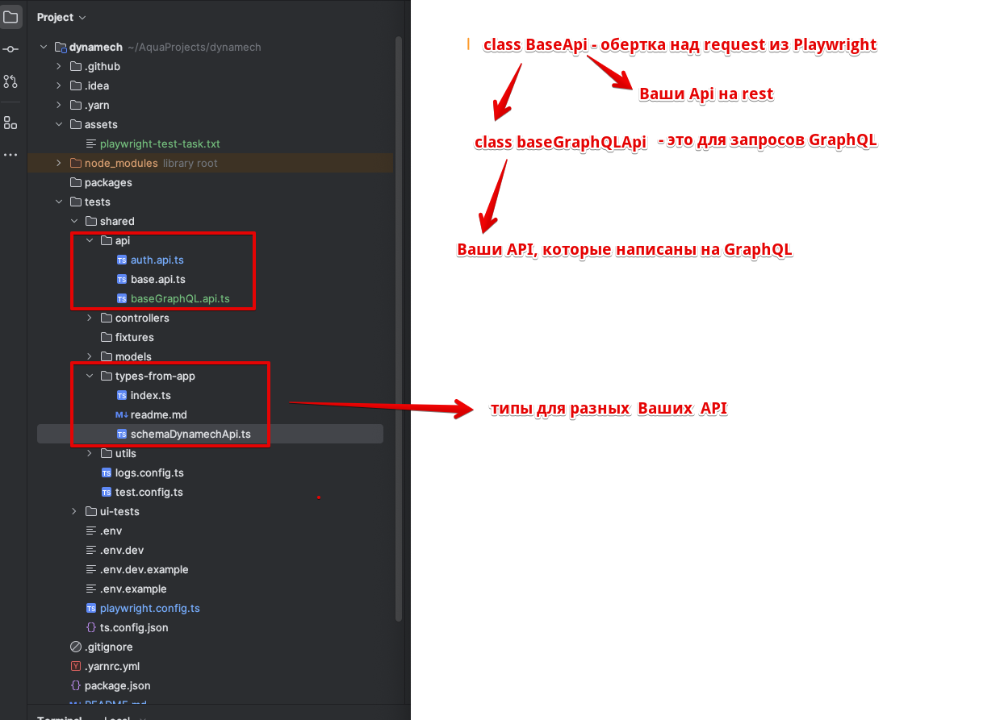

# dynamech

# Тестовое на вакансию QA Automation Engineer

## Запуск проекта

1. Склонировать репозиторий, открыть его в IDE
2. Переидти в ветку implementation

`git checkout implementation`

`git pull`
3. Установить все зависимости
   `yarn install`
4. Создать файл `.env` в папке `tests` и скопировать содержимое файла `.env.example` в него

Создать файл `.env.dev` в папке `tests` и скопировать содержимое файла `.env.dev.example` в него

5. Данный репозиторий содержит тесты на готовое B2B приложение доступное по [ссылке](https://aqatesttask.dynamech.io/business-v2/)

## Запуск тестов локально и как открыть Allure отчет

1. `cd ./tests`
2. Запускаем `npx playwright --version`. Версию показывает? Устанавливаем если что из папки tests командой `npx playwright install`
3. Запускаем `allure --version` . Версию показывает? Устанавливаем если что по [инструкции](https://allurereport.org/docs/install/)
4. Запуск тестов

`npx playwright test`

5. Сформировать и открыть отчет Allure

`allure serve allure-results`

## Как дебажить тесты

1. Все логи тестов смотреть в `tests/logs/info.log`
2. Снимки экрана и trace формируются в случае падения теста. Их можно будет найти как в папке
   `tests/test-results` так и скачать и посмотреть в allure отчете. Можете взять нужный файл trace.zip
и открыть сайт https://trace.playwright.dev/ и закинуть туда файл trace.zip.
Вот и все! Теперь Вы можете смотреть trace на сайте и в Вашем распоряжении там есть network и отображение страницы браузера
по всему timeline теста.
3. Вы также можете запустить тесты локально в песочнице - там можно будет тоже смотреть trace и там тоже есть network 
и отображение страницы браузера по всему timeline теста. Для этого следует запустить тесты с флагами

`npx playwright test --ui --debug`

## Перечень UI тестов с их кратким описанием

Краткое описание того, что именно проверяют тесты. Всего у нас три файла ui-тестов в папке `tests/ui-tests/tests`

1. `auth.test.ts`

**Авторизация:**
   - Залогиниться под предоставленным логином и паролем в B2B часть приложения (https://aqatesttask.dynamech.io/business-v2/).
   - Убедиться, что пользователь успешно вошел в систему.

   логин: jgreenfelder@turner.com
   пароль: customer

2. `workspace.test.ts`

**Создание Workspace:**
   - Создать новый workspace используя кнопку New workspace справа внизу меню.
   - Убедиться, что workspace успешно создан и отображается в списке.

**Добавление товаров:**
   - Добавить несколько товаров (2-3) одним из способов:
      - Через прямое добавление домера используя раздел вверху "Product search".
      - Через раздел вставки списка товаров, раздел "paste text" так же вверху.
        номера для добавления товаров можно посмотреть на workspace 1, который будет открыт по умолчанию при первом логине.

   - Убедиться, что все добавленные товары отображаются в списке с выбранными ценами.

3. `checkout.test.ts`

**Проверка Checkout:**
- Перейти в раздел **Checkout** используя кнопку "Checkout" внизу страницы.
- Убедиться, что доступна форма оплаты.
- Реализовать тесты для проверки:
   - **Товары в форме оплаты:**
      - Проверить, что список товаров на странице оплаты соответствует товарам, добавленным в workspace.
      - Убедиться, что цены товаров совпадают с указанными в workspace.
   - **Billing Country:**
      - Выбрать одну из стран Европы (например, Германия) и убедиться, что к **Total** добавляется налог.
      - Выбрать страну, не облагаемую налогом (например, из стран вне ЕС) и убедиться, что налог равен **0**.
   - **Доставка:**
      - Выбрать разные варианты доставки. 
      - Проверить что, когда мы выбираем self Pickup, стоимость доставки равна нулю и не увеличивает **Total**
      - Проверить что, когда мы НЕ выбираем self Pickup, стоимость доставки не увеличивает **Total** и появляется сообщение о том что мгновенно рассчитать стоимость доставки невозможно. И потому нас просят связаться с тех поддержкой и не дают оформить заказ самостоятельно.
   - **Способы оплаты:**
      - Bank Transfer.
        после оплаты страница должна меняться на Confirmation.

4.  `confirmation.test.ts`

**Проверка страницы Confirmation:**
- Убедиться, что после успешной оплаты отображается страница **Confirmation**.
- Проверить, что на странице указаны корректные данные заказа:
   - Список товаров, их цены и количества.
   - Общая сумма заказа с учетом налога и стоимости доставки, совпадает с тем что было на страницы оплаты.


## Видео с proofs

Видео с proofs что все запускается, запускается как надо, тесты проходят и allure отчет формируется и открывается -
вот [здесь](https://drive.google.com/file/d/1ZT_gn0crx4YsdkxE2gUJB1kP1ixgKgdq/view?usp=sharing)

Настройка `headless` в файле `tests/playwright.config.ts` на видео для наглядности была поставлена в false,
чтобы не бесить ревьюера кучей открытых окошек браузера
поставлю ее в true перед тем как отдасть на ревью.

## Ссылки на файл тестового задания и тестируемой формы

[файл тестового задания](./assets/playwright-test-task.txt)

[тестируемое готовое B2B приложение](https://aqatesttask.dynamech.io/business-v2/)

# Описание архитектуры тестового фреймворка, структуры папок и вообще всей концепции в целом
Вообще все построено по Domain-Driven Design (DDD) и схеме слоеного тестового фреймворка согласно ISTQB. 
И вот видео, где некосноязвчный человек рассказывает о том как писать тесты в рамках нее
https://www.youtube.com/watch?v=lb2WgCsMuzQ

## API слой

Сначала мы берем API бека которое у нас в тестируемом приложении. Предполагается что у нас есть документация на это API
с перечнем всех эндпоинтов и перечень всех его сущностей (Entity) с их типами классами и интерфейсами.
Все эти сущности спускаются с бека к нам в тесты.

Мы пишем классы-апишки с методами-эндпоинтами, которые потом будем использовать в тестах.
Например в интаграционных тестах на api мы будем прям в тестах вызывать классы-апишки и с 
их помощью тестировать эндпоинты.



Пометка: заметила что у Вас GraphQL есть, насчет AuthApi я копать глубоко не стала и просто расписала его как rest.

## Слой моделей и контролеров

Как было описано в предыдущем разделе: все сущности бека спускаются к нам в тесты.
Замечательно если есть автогенерация типов сущностей с бека - у GraphQL ее например можно настроить.

Каждой сущности соответствует своя модель - это просто тип сущности описанный в виде интерфейса - тупо какие поля есть
у этой сущности.

И некоторые сущности имеют контроллеры. Контролер это класс, в котором описаны все методы по взаймодействию с сущностью.
Например метод выдачи объекта сущности с заполненными рандомными данными с faker, или метод создания ее,
удаления и редактирования ее и прочие бизнесовые операции с нею, которые нам понадобятся в тестах.
В методах контроллеров используются методы классов-апишек.

Для подготовки данных для теста контроллеры с методами мы вызываем прямо в этих ui-тестах или в фикстурах.
Так мы делаем изоляцию.

Модели хранятся в папке - `tests/shared/models`
Контроллеры хранятся в папке - `tests/shared/controllers`

## Слой Fixture

Fixture - мы используем для подготовки для тестов.
Fixture - мы используем для авторизации пользователя в тестах с авторизованным пользователем.
см файл `tests/ui-tests/fixtures/customerFixture.ts`
Я за то, чтобы для каждого теста создавать отдельного пользователя. Это обеспечивает, что они не будут аффектить друг друга,
а значит упрощает их параллельный запуск.

В наших тестах везде используется один и тот же пользователь. Поэтому я прописала для них
последовательный запуск, чтобы при параллельном запуске они не аффектили друг друга.

test.describe.configure({ mode: 'serial', retries: 1 }) - это установка последовательного запуска тестов.
Ведь по дефолту Playwright тесты одного файла запускает параллельно.

Понятное дело чтобы авторизовывать пользователя для тестов - лучше дергать эндпоинты авторизации, чем в каждом тесте
прокликивать страницу авторизации - это банально быстрее.

## Слой POM

POM - Page Object Model - объектная модель web-страницы, представляет собой паттерн проектирования, 
который изолирует код тестов, интерфейс web-страницы и DOM приложения.

Также POM используют и для элементов которые повторяются на многих web-страницах. Например, header или меню пользователя.

Все POM-ы лежат в папке tests/ui-tests/pages-and-components

## Методы действий пользователя и assertions в POM

Методы действий пользователя и assertions специфичные для определенной web-страницы могут писать как в теле теста
так и в POM. Мне больше нравится второй подход - если там прям много всего или слишком специфично.
Но это на вкус и цвет. И если Вы другого мнения - то все ок)) 
я спокойно и успешно работала со многими коллегами у которых мнения с моим не совпадали)) 
Это нормально))

## Лучшие локаторы для устойчивости тестов к изменениям

В задании тестового написано ```Обеспечьте устойчивость тестов к возможным изменениям интерфейса.```
И явно тут намек на локаторы `getByTestId`. И да, я согласна, это самые лучшие локаторы для устоичивости тестов.
И предпочитаю использовать их. Заметила что у Вас на некоторые элементы проставлены 
`data-qa-ref` и я их использую: можно поискать по всему проекту `CTRL + SHIFT + F` для `getByTestId`
и увидеть это.

Где уж к сожалению нет `data-qa-ref` пришлось использовать менее устойчивые к изменениям интерфейса
локаторы: x-path-локаторы, css-локаторы, локаторы по role и по тексту.

Обычно на реальном проекте, я оговариваю контракт формирования названий `data-qa-ref` с фронтами
и пишу для этого контракта функцию. Эту функцию везде использую в коде фронта где нужно завести
`data-qa-ref`. Обычно при написании автотестов я сама пишу локаторы `data-qa-ref` в коде фронта 
(тем более я бывший фронт - мне сподручно),
и договариваюсь с фронтами, что если они будут менять там верстку, то с них обязательство оставлять локаторы
`data-qa-ref`.

## Вопросы, которые могли у Вас возникнуть по customerFixture и BaseApi

1. Я вот заметил, что использование customerFixture заставляет в каждом тесте в начале писать две строчки и в конце одну?
А можно поменьше? И вот в тесте `tests/ui-tests/tests/auth.test.ts` что-то много написано со всяким LocalStorage?

Да, да можно сократить до двух строк в каждом тесте - но в рамках тестового и неглубокого погружения в контекст проекта 
пусть так остается. А на реальной работе и со знанием контекста проекта можно сделать использование `customerFixture`
более приятным и лаконичным.

Можно и нужно убрать work-around c LOCALSTORAGE_FIELDS_FOR_AVOID__BANNER 
из тела теста `tests/ui-tests/tests/auth.test.ts` в `customerFixture`. Но в рамках тестового пока оставим так.

2. А зачем эта писанина с LOCALSTORAGE_FIELDS_FOR_AVOID__BANNER нельзя что ли крестик в тесте кликнуть?

Можно. Но это делается специально: work-around c LOCALSTORAGE_FIELDS_FOR_AVOID__BANNER отрабатывает в ui тестах 
быстрее чем прокликивание. Плюс так лучше для масштабирования. Ведь по хорошему work-around c LOCALSTORAGE_FIELDS_FOR_AVOID__BANNER
должен быть написан в одном месте - в `customerFixture`. Что лучше перед новогодними править кучу тестов
добавляя туда прокликивание или поправить одно место в `customerFixture` ? Конечно, второе)) 

3. Я вот заметил, что использование customerFixture заставляет в каждом тесте одного файла в начале писать две строчки и в конце одну?
А может их просто написать в одном на весь файл `beforeEach` и `afterEach` ? 

Увы нельзя. Playwright поворачивает в сторону фикстур от тестовых хуков (`beforeEach` и `afterEach` и т д). И еще разработчики
Playwright запретили вызов кастомных фикстур в тестовых хуках. В общем это большая и больная тема для всего сообщества
Playwright и она вылита в кучу issues и обсуждений в репе Playwright.

4. Зачем "эдакий синглтон" в BaseApi с полем `uiTestContext` и его переприсвоение в `customerFixture` и в других местах ?

Это обходной маневр, который позволяет сделать так чтобы в рамках одного ui-теста могли участвовать несколько
авторизованных пользователей одновременно. Таких тестов стараются избегать и они редкость. Но иногда без них никак 
и они очень нужны проекту из-за его специфики. Например, ставка сделанная в беттинге или в онлайн-казино двумя пользователями одновременно.

И лучше спроектировать систему так, чтобы она смогла выдержать такой необычный ход событий, чем в один миг окажется, что
мы тупо не можем написать нужный нам тест из-за архитектуры тестового фреймворка.


## Пока) Хорошего дня) Буду рада встрече)
